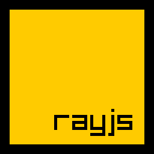
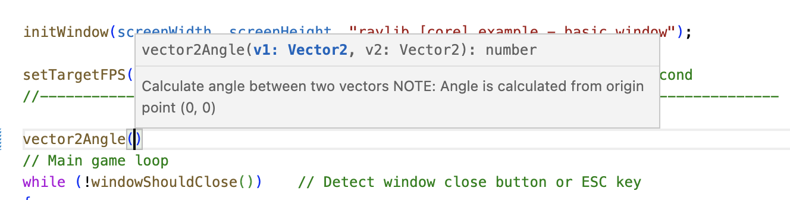
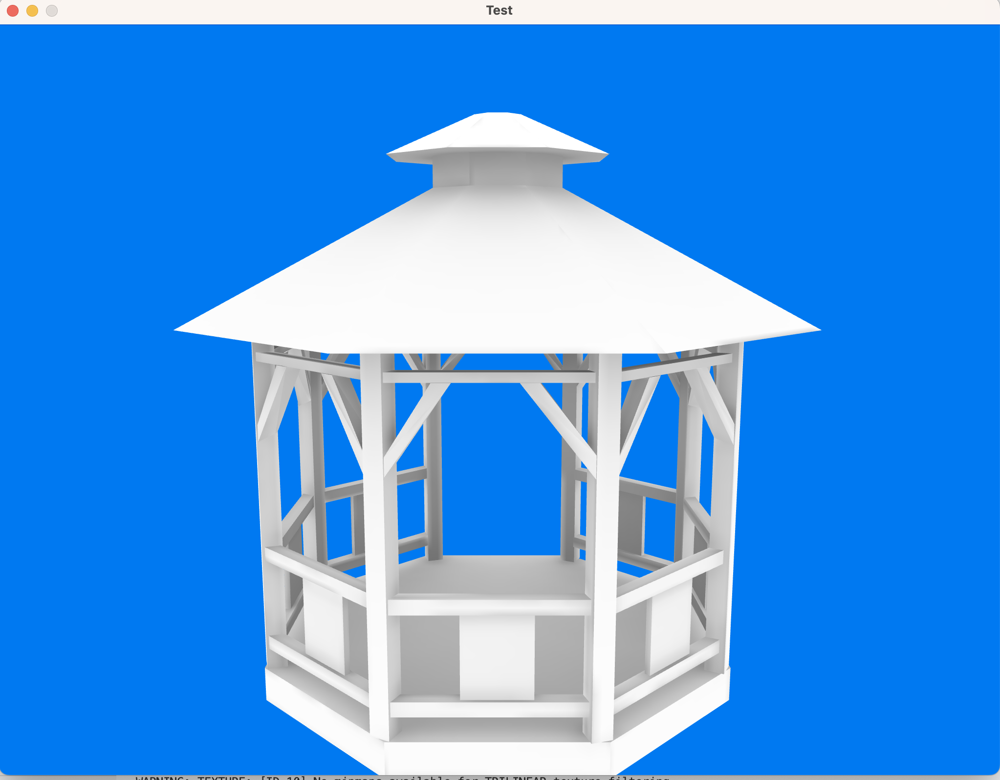
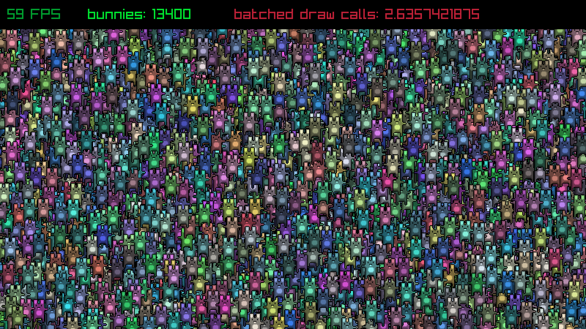

# rayjs - Javascript + Raylib
QuickJS based Javascript bindings for raylib in a single ~3mb executable

## What is this?
rayjs is small ES2020 compliant Javascript interpreter based on [QuickJS](https://bellard.org/quickjs/) with bindings for [Raylib](https://www.raylib.com/). You can use it to develop tiny desktop games with Javascript.

## What this is not
rayjs is not a binding for NodeJS nor is it running in the browser, or phone (yet). It's comes with its own Javascript engine (QuickJS) similar to how NodeJS comes with the V8 engine. That makes it much easier to run and distribute rayjs programs as all you need to run a program / game is the small rayjs executable. No installation, no dlls or additional files are needed.

## Features
* Compiles into a single, small executable without any dependencies for easy distribution
* Use modern Javascript features like classes or async/await
* In-depth auto-complete with definitions for the whole API

## Getting started
1. Download the binary for your platform from the [release section](https://github.com/RealVarHar/rayjs/releases).
2. Unzip the executable to a folder and create a new text file in the same folder. Rename the file to `main.js`
3. Open the file with a text-editor (e.g. Notepad) and add the following code
    ```javascript
    const screenWidth = 800;
    const screenHeight = 450;

    initWindow(screenWidth, screenHeight, "raylib [core] example - basic window");

    setTargetFPS(60);   
    while (!windowShouldClose()) {
        beginDrawing();

            clearBackground(RAYWHITE);

            drawText("Congrats! You created your first window!", 190, 200, 20, LIGHTGRAY);

        endDrawing();
    }
    closeWindow();
    ```
4. Run the `rayjs` executable
5. Congratulations, you have created your first rayjs app. 

## Running code
rayjs application shares usage options with QJS, with help avaliable through rayjs.exe -help
```
usage: rayjs [options] [file [args]]
-h  --help         list options
-e  --eval EXPR    evaluate EXPR
-i  --interactive  go to interactive mode
-m  --module       load as ES6 module (default=autodetect)
--script       load as ES6 script (default=autodetect)
-I  --include file include an additional file
--std          make 'std','os','bjson','raylib' available to the loaded script
-T  --trace        trace memory allocation
-d  --dump         dump the memory usage stats
-D  --dump-flags   flags for dumping debug data -D=<bitmask> (see DUMP_* defines)
--memory-limit n       limit the memory usage to 'n' Kbytes
--stack-size n         limit the stack size to 'n' Kbytes
--unhandled-rejection  dump unhandled promise rejections
-q  --quit         just instantiate the interpreter and quit
```


## API support

The following raylib APIs are supported so far (with a few exceptions):

- core (no VR support yet)
- shapes
- textures
- text (no support for GlyphInfo yet)
- models (no animation support)
- shaders
- audio
- raymath
- rcamera
- rlights
- raygui
- reasings

Similar to including a header in C and for your convenience, all types/functions are provided globally. They are additionally available in a module called 'raylib'

To check which API functions are not available (yet) check `/bindings/src/index.js` for `ignore` statements.

## Additional APIs

Rayjs comes with bindings to [lightmapper.h](https://github.com/ands/lightmapper/tree/master). See below for more information.

## Auto-Complete / Intellisense

rayjs comes with full auto-complete support in the form of the definitions file `lib.raylib.d.ts`. These will work with Typescript and Javascript. In order to use them with Javascript you should create a Typescript configuration file in the project root (even if you are not using Typescript) called `tsconfig.json` with the following configuration
```json
{
  "compilerOptions": {
    "allowJs": true,
    "target": "es2020",
    "lib": [
      "ES2020"
    ]
  }
}
```
After that put the `lib.raylib.d.ts` file in the same folder and optionally restart your IDE. Auto-complete should be working:


## Examples

Some official raylib examples were already ported to Javascript and can be found in the `examples` folder. 

Additional examples are described here.

```
./rayjs examples/js_example_project
```
Barebones example project on how to structure a project that uses Javascript
```
./rayjs examples/js_mesh_generation.js
```
Shows how to create a mesh from Javascript ArrayBuffers
```
./rayjs examples/shaders/js_shaders_gradient_lighting.js
```
Creates a gradient and uses it as lighting for a 3d scene
```
./rayjs examples/ts_dungeon
```
Small example game that uses Typescript with Webpack for transpilation and bundling
```
./rayjs examples/ts_game
```
Example how to integrate existing JS libraries. This example integrates the Inkjs library to compile and play a game written in the Ink interactive fiction language.


### Lightmapper usage
Rayjs integrates the [lightmapper.h](https://github.com/ands/lightmapper/tree/master) library to render baked lighting. 
The example demonstrates it's usage.
```
./rayjs examples/js_lightmapper.js
```

Meshes must have unwrapped lightmap uvs in the second UV channel.



The example uses an environment that is uniform white which will lead to baking pure ambient occlusion. To bake other light sources, lower the amount of ambient lighting and everything that is rendered with a color other than black will become an emissive lightsource during baking. Rendering will just work as usual and custom shaders are supported. E.g. while the raylib default shader does not support color intensities greater than 1.0, the lightmapper does support them for higher intensity lighting.

The example will try to bake lighting alongside the render loop which is still buggy and leads to artifacts. Baking before rendering works better.

## Performance
QuickJS is one of the [faster JS interpreters](https://bellard.org/quickjs/bench.html). I'm getting about 13000 bunnys in the unmodified bunnmark before dropping any frames on my 2020 Macbook Air M1 which seems pretty good.
 

## Building
Here are some basic steps if you want to compile rayjs yourself.

### Check out required files
```bash
git clone https://github.com/RealVarHar/rayjs.git
git submodule update --init --recursive
```
### Build bindings
Rayjs builds bindings from sources, to refresh those, run
```bash
cd rayjs
qjs.exe bindings/src/index.js
```
qjs.exe can be aquired from https://github.com/quickjs-ng/quickjs or rayjs.exe itself can be used

### Build with cmake
Make sure you have cmake installed and in your path.
```bash
cd rayjs
mkdir build
cd build
cmake ..
make
```
For windows mingw is recommended, builds are tested with https://winlibs.com
```bash
cd rayjs
mkdir build
cd build
cmake ..
mingw32-make
```


